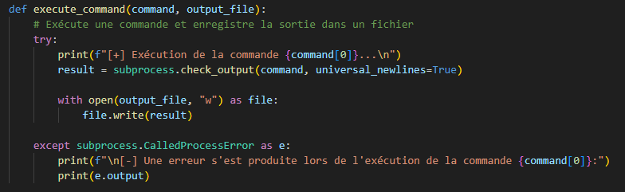
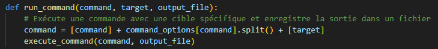
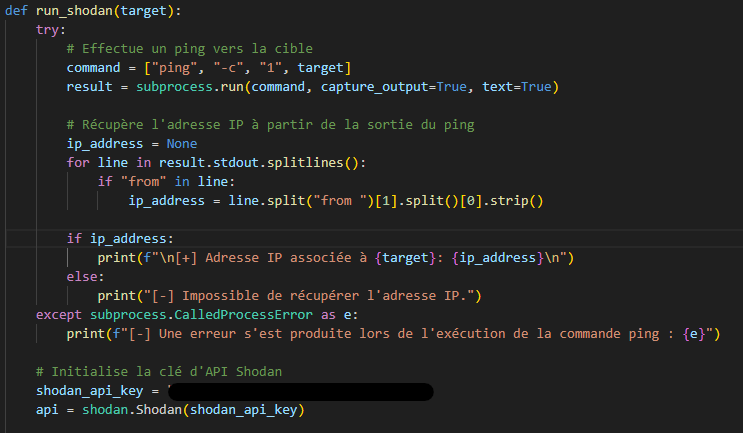
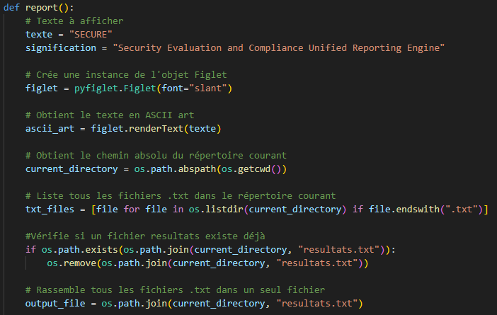
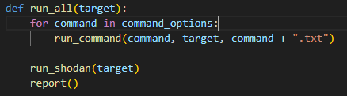
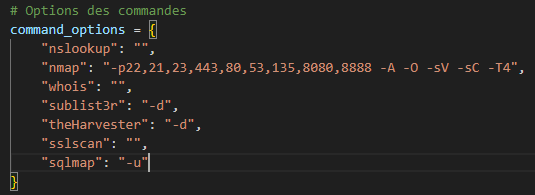

# SECURE - Security Evaluation and Compliance Unified Reporting Engine


Ce script est conçu pour effectuer une évaluation de sécurité en automatisant la phase de reconnaissance lors d'un test d'intrusion et générer un rapport unifié des résultats. Il utilise différentes commandes système pour recueillir des informations sur une cible spécifiée, effectuer une recherche Shodan et générer un rapport final.

## Description 

Le script est développé en Python et utilise des modules tels que **'subprocess'**, **'pyfiglet'**, **'os'**, **'shodan'** et **'glob'**. Il permet d'automatiser la collecte d'informations sur une cible, d'effectuer une recherche Shodan pour obtenir des informations supplémentaires et de générer un rapport final contenant tous les résultats obtenus.

## Fonctionnalités

Le script propose les fonctionnalités suivantes:

- Exécute différentes commandes système pour recueillir des informations sur la cible :
    - **'nslookup'**: effectue une recherche DNS pour obtenir les informations liées à l'adresse IP ou au nom de domaine spécifié.
    - **'whois'**: récupère les informations Whois sur la cible.
    - **'nmap'**: effectue un balayage de ports sur la cible en utilisant les options spécifiées dans le dictionnaire **'command_options'**.
    - **'sublist3r'**: effectue une recherche de sous-domaines à partir du nom de domaine spécifié.
    - **'theHarvester'**: effectue une recherche d'informations sur la cible en utilisant des moteurs de recherche publics.
    - **'sslscan'**: effectue une analyse de la sécurité SSL/TLS du serveur cible.
    - **'sqlmap'**: effectue une injection SQL sur une URL spécifiée pour détecter d'éventuelles vulnérabilités.
- Effectue une recherche Shodan pour obtenir des informations supplémentaires sur la cible :
    - Effectue un ping vers la cible pour obtenir son adresse IP.
    - Utilise l'API Shodan pour effectuer une recherche d'informations sur la cible.
    - Récupère des détails tels que l'organisation, le pays, les ports ouverts et les vulnérabilités connues.
- Génère un rapport final unifié contenant tous les résultats obtenus :
    - Crée un fichier de rapport resultats.txt.
    - Ajoute les résultats de chaque commande exécutée dans le rapport.

## Usage

1. Assurez-vous d'avoir les pré-requis mentionnés ci-dessous.
2. Placez le script dans un répertoire de votre choix.
3. Ouvrez un terminal et accédez au répertoire où se trouve le script.
4. Exécutez le script à l'aide de la commande suivante (en utilisant **'sudo'** pour les privilèges d'administration) :
```sh
sudo python ./SECURE/secure.py
```
5. Entrez une adresse IP ou un nom de domaine.
6. Le script exécute toutes les commandes définies dans le dictionnaire **'command_options'** avec la cible spécifiée. Il est donc très simple d'ajouter de nouvelles commandes si besoin.
7. Une recherche Shodan est effectuée pour obtenir des informations supplémentaires sur la cible.
8. Les résultats de chaque commande exécutée sont enregistrés dans des fichiers **'.txt'**.
9. Un rapport final est généré en rassemblant tous les fichiers **'.txt'** dans un fichier **'resultats.txt'**.
10. Le rapport final est enregistré dans le répertoire courant.

## Pré-requis

Avant d'exécuter le script, assurez-vous d'avoir les éléments suivants :

- Python installé sur votre système.
- Les modules Python suivants installés :
    - **'subprocess'** : vous pouvez l'installer en exécutant la commande **'pip install subprocess'**.
    - **'pyfiglet'** : vous pouvez l'installer en exécutant la commande **'pip install pyfiglet'**.
    - **'shodan'**: vous pouvez l'installer en exécutant la commande **'pip install shodan'**.

## Explication du code


Le script est composé de plusieurs fonctions pour accomplir différentes tâches :

- **'execute_command(command, output_file)'** : cette fonction exécute une commande système spécifiée et enregistre la sortie dans un fichier.
    

    
- Cette fonction prend deux paramètres : **'command'** (une liste représentant la commande à exécuter) et **'output_file'** (le nom du fichier dans lequel enregistrer la sortie de la commande). Voici une explication détaillée du code :
    1. La fonction commence par afficher un message indiquant quelle commande est en cours d'exécution en utilisant la notation f-string pour formater la chaîne de caractères. La commande est extraite en utilisant **'command[0]'**, qui correspond au premier élément de la liste **'command'**.
    2. Ensuite, la fonction utilise le module **'subprocess'** pour exécuter la commande spécifiée. La méthode **'check_output'** de ce module prend la commande en tant qu'argument et renvoie la sortie de la commande en tant que chaîne de caractères. L'argument **'universal_newlines=True'** est utilisé pour obtenir la sortie sous forme de chaîne de caractères plutôt que d'octets.
    3. La sortie de la commande est ensuite écrite dans un fichier spécifié par **'output_file'**. La ligne **'with open(output_file, "w") as file:'** ouvre le fichier en mode écriture ("w") et crée automatiquement un contexte de gestion des fichiers, ce qui garantit que le fichier sera correctement fermé après son utilisation. La sortie de la commande est ensuite écrite dans le fichier à l'aide de **'file.write(result)'**.
    4. Si une exception de type **'CalledProcessError'** est levée lors de l'exécution de la commande (par exemple, si la commande retourne un code de sortie différent de zéro), le bloc **'except'** sera exécuté. À l'intérieur de ce bloc, un message d'erreur est affiché indiquant quelle commande a échoué (**'command[0]'**) et la sortie d'erreur de la commande (**'e.output'**) est également affichée.

- **'run_command(command, target, output_file)'** : cette fonction exécute une commande système avec une cible spécifique et enregistre la sortie dans un fichier.



- Cette fonction prend trois paramètres : **'command'** (une chaîne de caractères représentant la commande à exécuter), **'target'** (une chaîne de caractères représentant la cible spécifique de la commande) et **'output_file'** (le nom du fichier dans lequel enregistrer la sortie de la commande). Voici une explication détaillée du code :
    1. La fonction commence par créer une nouvelle liste appelée **'command'** en combinant plusieurs éléments : la commande initiale (**'command'**), des options spécifiques à la commande obtenues à partir du dictionnaire **'command_options'**, et la cible spécifique (**'target'**). La variable **'command'** est écrasée pour contenir cette nouvelle liste.
    2. Ensuite, la fonction appelle une autre fonction appelée **'execute_command'** en passant la liste **'command'** et **'output_file'** en tant qu'arguments. Cela exécute la commande spécifiée avec la cible spécifique et enregistre la sortie dans le fichier spécifié.

- **'run_shodan(target)'** : cette fonction effectue un ping vers la cible pour obtenir son adresse IP, puis utilise l'API Shodan pour effectuer une recherche d'informations sur la cible.


.png)

- Cette fonction prend un seul paramètre : **'target'** (une chaîne de caractères représentant la cible spécifique de la commande). Voici une explication détaillée du code :
    1. Dans le bloc **'try'**, le code commence par effectuer un ping vers la cible en utilisant la commande ping avec un seul paquet (**'-c 1'**). La sortie du ping est capturée en utilisant les options **'capture_output=True'** et **'text=True'**, qui permettent de récupérer la sortie en tant que chaîne de caractères.
    2. Ensuite, le code recherche l'adresse IP à partir de la sortie du ping. Il itère sur chaque ligne de la sortie (**'result.stdout.splitlines()'**) et vérifie si la ligne contient le mot "from". Si c'est le cas, il extrait l'adresse IP de la ligne en utilisant des opérations de division de chaînes et l'assigne à la variable **'ip_address'**.
    3. Si une adresse IP est récupérée avec succès, le code affiche un message indiquant l'adresse IP associée à la cible. Sinon, il affiche un message indiquant qu'il n'a pas été possible de récupérer l'adresse IP.
    4. Si une exception de type **'CalledProcessError'** est levée lors de l'exécution de la commande ping (par exemple, si la cible n'est pas accessible), le bloc **'except'** sera exécuté. Il affiche un message d'erreur indiquant qu'une erreur s'est produite lors de l'exécution de la commande ping, et affiche également l'erreur spécifique (**'e'**).
    5. Ensuite, le code initialise la clé d'API Shodan en assignant une clé d'API pré-définie à la variable **'shodan_api_key'**. Cela permet d'accéder à l'API Shodan pour effectuer des recherches ultérieures.
    6. Dans le deuxième bloc **'try'**, le code affiche un message indiquant qu'il va exécuter la commande Shodan. Ensuite, il utilise l'API Shodan pour effectuer une recherche d'informations sur la cible en utilisant la méthode **'host(ip_address)'**. Les résultats de la recherche sont stockés dans la variable **'results'**.
    7. Ensuite, le code affiche un message indiquant que les résultats de Shodan sont disponibles. Il extrait les informations essentielles des résultats, telles que l'organisation, le pays, les ports ouverts et les vulnérabilités connues. Ces informations sont formattées dans une chaîne de caractères **'output'**.
    8. Le code enregistre ensuite les résultats dans un fichier texte nommé "shodan.txt" en utilisant le bloc **'with open("shodan.txt", "w") as file:'**. Les résultats formatés sont écrits dans le fichier à l'aide de **'file.write(output)'**.
    9. Si une exception de type **'APIError'** est levée lors de l'exécution de la commande Shodan (par exemple, en cas d'erreur d'authentification), le bloc **'except'** sera exécuté. Il affiche un message d'erreur indiquant qu'une erreur s'est produite lors de l'exécution de la commande Shodan, et affiche également l'erreur spécifique (**'e'**).

- **'report()'** : cette fonction génère un rapport final en rassemblant tous les fichiers **'.txt'** dans un fichier **'resultats.txt'**.


.png)

- Cette fonctione ne prend aucun paramètre. Voici une explication détaillée du code :
    1. La fonction récupère le chemin absolu du répertoire courant en utilisant la fonction **'os.getcwd()'**.
    2. Le code liste tous les fichiers avec l'extension ".txt" dans le répertoire courant en utilisant une compréhension de liste avec la fonction **'os.listdir()'** et une condition avec **'file.endswith(".txt").'**
    3. Le code vérifie si un fichier nommé "resultats.txt" existe déjà dans le répertoire courant en utilisant la fonction **'os.path.exists()'**. Si le fichier existe, il est supprimé en utilisant **'os.remove()'**.
    4. Le code crée un fichier de sortie nommé "resultats.txt" dans le répertoire courant en utilisant la fonction **'os.path.join()'**. Le fichier est ouvert en mode écriture (**'"w"'**) à l'aide du bloc **'with open(output_file, "w") as output:'**.
    5. Ensuite, le code parcourt tous les fichiers **'.txt'** présents dans le répertoire courant et écrit leur contenu dans le fichier de sortie. Il ajoute également des en-têtes spécifiant le nom de chaque fichier traité.
    6. Une fois tous les fichiers **'.txt'** traités, le code utilise la fonction **'glob.glob()'** pour lister tous les fichiers **'.txt'** dans le répertoire courant.
    7. Le code supprime tous les fichiers **'.txt'** à l'exception du fichier de rapport (**'resultats.txt'**) en utilisant une boucle **'for'** et la fonction **'os.remove()'**.

- **'run_all(target)'** : cette fonction exécute toutes les commandes définies dans le dictionnaire command_options avec la cible spécifiée. Elle appelle également les fonctions **'run_shodan(target)'** et **'report()'**.



- Cette fonction prend un seul paramètre : **'target'** (une chaîne de caractères représentant la cible spécifique de la commande). Voici une explication détaillée du code :
    1. La fonction commence par une boucle **'for'** qui itère sur chaque commande présente dans **'command_options'**. Pour chaque commande, elle appelle la fonction **'run_command'** en passant la commande, la cible et le nom de fichier (en concaténant la commande avec l'extension ".txt").
    2. Après avoir exécuté toutes les commandes avec la fonction **'run_command'**, la fonction appelle la fonction **'run_shodan'** en passant la cible. Cela exécute la commande Shodan pour rechercher des informations sur la cible.
    3. Enfin, la fonction appelle la fonction **'report'** pour générer un rapport à partir des fichiers texte générés par les commandes précédentes. Le rapport est créé et enregistré dans le fichier "resultats.txt".

- **'command_options'** : Ce dictionnaire associe des options à différentes commandes. 



1. Le dictionnaire **'command_options'** contient des paires clé-valeur, où la clé représente le nom de la commande et la valeur représente les options associées à cette commande.
2. Le dictionnaire **'command_options'** permet de spécifier les options pour chaque commande utilisée dans le code précédent, comme dans la fonction **'run_command'**. Cela permet de personnaliser les options pour chaque commande et de les passer aux appels de fonction appropriés.